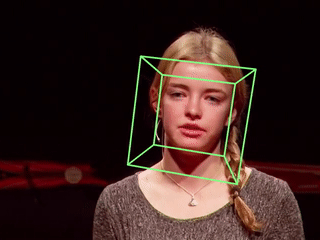
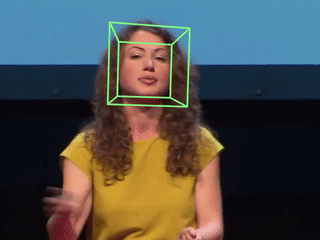

# Head pose estimation

Realtime human head pose estimation with ONNXRuntime and OpenCV.





Clone the repo:
```bash
git clone https://github.com/yinguobing/head-pose-estimation.git
```

Install dependencies with pip:
```bash
pip install -r requirements.txt
```
